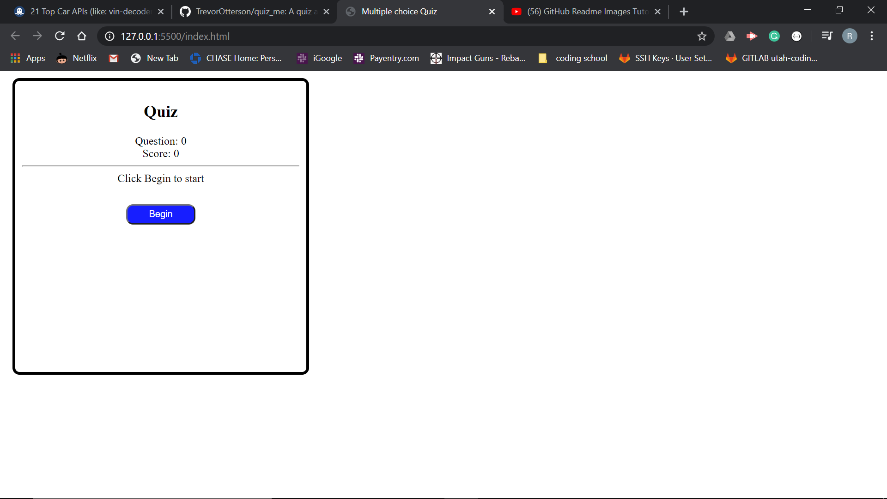
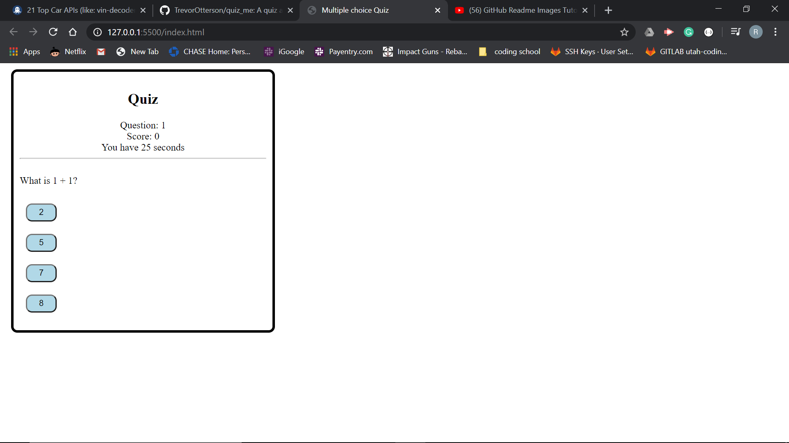
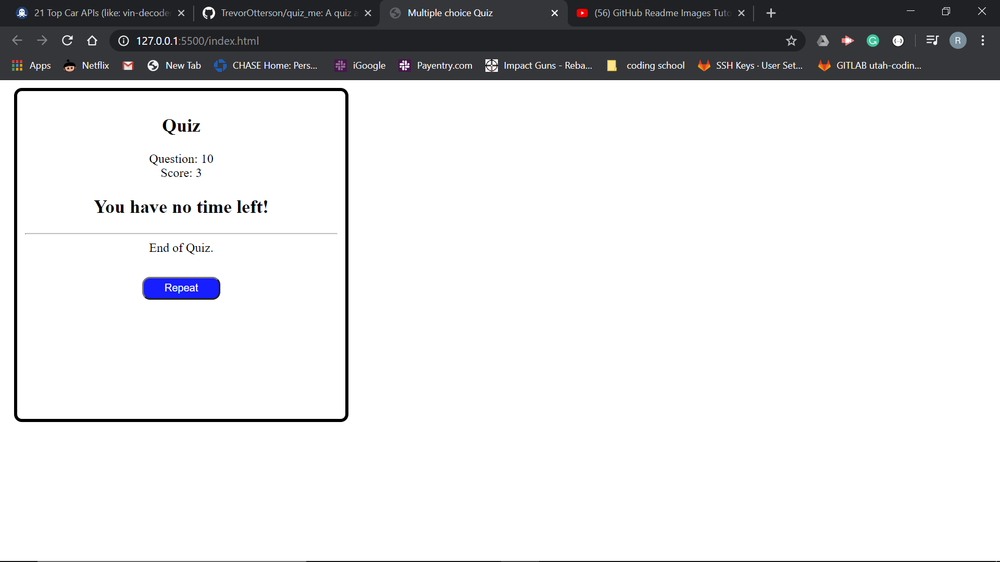

# Code-Quiz
HW week 4
i started off understanding this homework in the beggining but bacame harder as i got towards the end. i tried to impliment various ways with the score saving and enetering initials at the end. i believed i might have missed a few things but i learned a lot throught this process, here is the link to my project 

